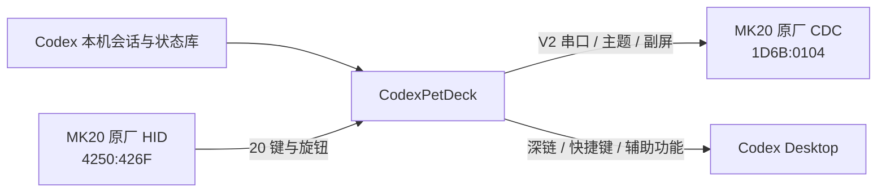

# CodexPetDeck

[](LICENSE)

原生 macOS SwiftUI 应用，把 ScreenKey MK20 变成 Codex Desktop 的 20 键控制台和实时状态面板。

> 当前状态：实验性开源项目。主流程已在 MK20 固件 V2.32 与 macOS 14+ 上验证；一台测试设备的物理 K18 存在扫描异常，详见 [K18 排查记录](docs/K18_INVESTIGATION.md)。

## 能做什么

- 监听本机 `~/.codex/sessions/**/*.jsonl`，展示最近会话、任务状态、工具事件、累计 token 和额度。
- 把状态通过 MK20 V2 `cmd=1` 实时推送到 428×142 副屏。
- 部署完整 4×5 Codex 主题：6 个会话键、审批、拒绝、分支、语音、新任务、滚动、复制、项目目录和停止。
- 使用两枚三向旋钮切换会话、聚焦 Codex、滚动和停止任务。
- 任务完成时播放提示音，并在对应会话键上显示绿色脉冲动画。
- 提供安全的 `20 键 + 6 旋钮` 硬件自检；自检期间不会执行真实 Codex 动作。
- 通过 Codex 深链、macOS 快捷键和辅助功能 API 控制 Codex Desktop，不修改、不注入、不重签 `Codex.app`。

## 当前架构



应用固定使用 MK20 原厂双通道：CDC 负责握手、文件传输和副屏数据，SYK HID 负责物理输入。正常运行不会改写 `/mnt/SDCARD/lunch.sh`，也不会加载自定义 Linux 模块。

## 默认按键布局

| | 第 1 列 | 第 2 列 | 第 3 列 | 第 4 列 | 第 5 列 |
|---|---|---|---|---|---|
| 第 1 行 | 会话 1 | 会话 2 | 会话 3 | 会话 4 | 会话 5 |
| 第 2 行 | 会话 6 | 快速 | 接受 | 拒绝 | 分支 |
| 第 3 行 | 语音 | 新任务 | 上会话 | 下会话 | 复制答复 |
| 第 4 行 | 聚焦 | 上翻 | 项目目录（K18） | 下翻 | 停止 |

- 左旋钮：上一会话 / 按压聚焦 / 下一会话
- 右旋钮：上翻 / 按压停止 / 下翻

K18 的低频“项目目录”功能是针对测试设备扫描异常的临时降级安排，并不表示 MK20 标准布局要求如此。

## 系统要求

- macOS 14 或更高版本
- Xcode 16 或更高版本
- Codex Desktop
- ScreenKey MK20；当前主要验证固件为 V2.32
- 输入监控权限；部分桌面动作还需要辅助功能权限

## 构建和运行

1. 打开 `CodexPetDeck.xcodeproj`。
2. 选择 `CodexPetDeck` Scheme。
3. 在 Signing & Capabilities 中选择自己的 Apple Development Team。
4. 构建并运行，然后根据界面提示授予输入监控与辅助功能权限。
5. 连接 MK20，确认识别成功后显式点击“部署主题”。

项目由 `project.yml` 管理。新增源码后可运行：

```sh
xcodegen generate
```

命令行测试：

```sh
xcodebuild \
  -project CodexPetDeck.xcodeproj \
  -scheme CodexPetDeck \
  -destination 'platform=macOS' \
  -derivedDataPath /tmp/CodexPetDeckDerived \
  test CODE_SIGNING_ALLOWED=NO
```

### 保持 macOS 权限稳定

macOS TCC 权限与应用身份、签名和路径相关。更新时应保持相同 Bundle ID、签名团队和应用路径，不要用临时 ad-hoc 签名覆盖日常运行副本。换电脑或更换签名团队后，系统要求重新授权属于正常行为。

运行日志位于：

```text
~/Library/Application Support/CodexPetDeck/pet-events.log
```

日志可能包含项目名和本机路径，提交 Issue 前请先脱敏。

## 重要安全边界

- 主题上传必须等待 `FILE_START` ACK；`FILE_END` 后必须先发送 Abort，再等待 ACK。
- 不要让官方 ScreenKey 应用和 CodexPetDeck 同时占用同一个串口。
- `DeviceSupport/` 中的 Codex Micro/Linux gadget 是早期实验记录，不属于生产路径，也不会被打包进应用。
- 编译产物、设备专用 `.ko`、ARM 二进制、签名证书和 Codex 会话均不会进入仓库。

## 文档

- [架构与 MK20 协议](docs/ARCHITECTURE_AND_PROTOCOL.md)
- [K18 排查记录](docs/K18_INVESTIGATION.md)
- [开发与实验历史](docs/DEVELOPMENT_HISTORY.md)
- [贡献指南](CONTRIBUTING.md)
- [安全与硬件风险](SECURITY.md)

## 参考项目

- [alexmuraru27/MK20Control](https://github.com/alexmuraru27/MK20Control)：独立的 MK20 主机协议实现，用于交叉核对 V2 帧、主题结构、按键坐标和文件上传时序。

CodexPetDeck 是非官方社区项目，与 OpenAI、Waveshare、ScreenKey 或 MK20Control 作者无隶属或背书关系。

## License

项目主体采用 [MIT License](LICENSE)。`DeviceSupport/LinuxModule/codex_hid.c` 根据文件中的 SPDX 标识采用 GPL-2.0-or-later。
